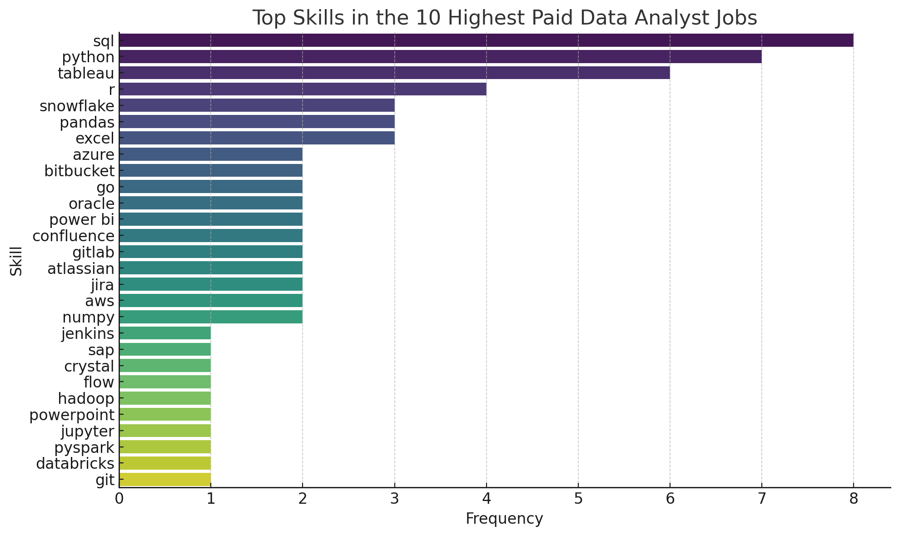

# Introduction

This project explores top-paying
jobs, in-demand skills, and where high
demand meets high salary in data analytics.
Check out all SQL queries here: [project_sql_folder](/sql_project/).

### The questions I wanted to answer through my SQL queries were:

1. What are the top-paying data analyst jobs?
2. What skills are required for these top-paying jobs?
3. What skills are most in demand for data analysts?
4. Which skills are associated with higher salaries?
5. What are the most optimal skills to learn?

# Tools I Used

- **SQL**
- **PostgreSQL**
- **Visual Studio Code**
- **Git & GitHub**

# The Analysis

### 1. Top Paying Data Analyst Jobs

```sql
select
jpf.job_id,
jpf.job_title,
jpf.job_location,
jpf.job_schedule_type,
jpf.salary_year_avg,
jpf.job_posted_date,
cd.name as company_name
from job_postings_fact jpf
left join company_dim cd on jpf.company_id = cd.company_id
where job_title_short = 'Data Analyst'
and job_location = 'Anywhere'
and salary_hour_avg is not null
order by salary_year_avg DESC
limit 10;
```

### 2. Top Paying Job Skills

```sql

with top_paying_jobs as (
select
jpf.job_id,
jpf.job_title,
jpf.salary_year_avg,
cd.name as company_name
from job_postings_fact jpf
left join company_dim cd on jpf.company_id = cd.company_id
where job_title_short = 'Data Analyst'
and job_location = 'Anywhere'
and salary_year_avg is not null
order by salary_year_avg DESC
limit 10
)

select
tpj.*,
sd.skills
from top_paying_jobs tpj
inner join skills_job_dim sjd on tpj.job_id = sjd.job_id
inner join skills_dim sd on sjd.skill_id = sd.skill_id
order by salary_year_avg desc;
```

**Key Insights:**

- SQL is the most frequently mentioned skill — it's foundational for data roles.
- Python follows closely, indicating its importance in data analysis and automation.
- Azure and Databricks appear often — showing the value of cloud platforms and big data tools.
- Other notable skills: R, Power BI, Spark, and AWS.



### 3. Top Demanded Skills

```sql
select skills,
    count(sjd.job_id) as demand_count
from job_postings_fact jpf
    join skills_job_dim sjd on jpf.job_id = sjd.job_id
    join skills_dim sd on sjd.skill_id = sd.skill_id
where job_title_short = 'Data Analyst'
group by skills
order by demand_count desc
limit 5;
```

### 4. Top Paying Skills

```sql
select skills,
    round(avg(salary_year_avg), 0) as average_salary
from job_postings_fact jpf
    join skills_job_dim sjd on jpf.job_id = sjd.job_id
    join skills_dim sd on sjd.skill_id = sd.skill_id
where job_title_short = 'Data Analyst'
    and salary_year_avg is not null
group by skills
order by average_salary desc
limit 25;
```

**Insights:**

1.  Engineering & DevOps Skills Pay Off
    Skills like Terraform, Puppet, Ansible, Kafka, Airflow, GitLab, and VMware are highly paid.
    This shows that Data Analysts with data engineering or DevOps automation skills command higher salaries, as companies value those who can manage pipelines, infrastructure, and deployment.

2.  AI & Machine Learning Tools Are in Demand
    High-paying skills include Hugging Face, Keras, TensorFlow, PyTorch, MXNet, and DataRobot.
    There’s a clear premium on Data Analysts who work with machine learning models, especially in deep learning and NLP, even if it’s not their core role.

3.  Specialized or Niche Tools Drive Salaries Up
    Less common tools like SVN, Solidity, Couchbase, and Datarobot offer top salaries.
    This suggests that rarity of skill and domain-specific expertise (e.g., blockchain or legacy systems) can significantly boost earning potential.

### 5. Optimal Skills

```sql
with skills_demand as (
    select sd.skill_id,
        sd.skills,
        count(sjd.job_id) as demand_count
    from job_postings_fact jpf
        join skills_job_dim sjd on jpf.job_id = sjd.job_id
        join skills_dim sd on sjd.skill_id = sd.skill_id
    where job_title_short = 'Data Analyst'
        and salary_year_avg is not null
        and job_work_from_home = true
    group by sd.skill_id
),
average_salary as (
    select sd.skill_id,
        sd.skills,
        round(avg(salary_year_avg), 0) as avg_salary
    from job_postings_fact jpf
        join skills_job_dim sjd on jpf.job_id = sjd.job_id
        join skills_dim sd on sjd.skill_id = sd.skill_id
    where job_title_short = 'Data Analyst'
        and salary_year_avg is not null
        and job_work_from_home = true
    group by sd.skill_id
)
select skills_demand.skill_id,
    skills_demand.skills,
    demand_count,
    avg_salary
from skills_demand
    inner join average_salary on skills_demand.skill_id = average_salary.skill_id
where demand_count > 10
order by avg_salary desc,
    demand_count desc
limit 25;
```

# Conclusions

### Insights

High Salary Doesn't Always Mean High Demand.
Some of the top-paying skills (like SVN, Couchbase, and Solidity) are niche and less commonly required. While they offer high salaries, they aren't in high demand across many job postings — suggesting they’re valuable only in specific contexts.

SQL & Python Are Both In-Demand and Well-Paying
These foundational tools consistently appeared in both high-paying jobs and high-demand lists, making them essential for both entry-level and advanced data analyst roles.

Cloud & Engineering Tools Open Up Higher Salaries
Skills related to DevOps, infrastructure, and cloud technologies (e.g., Terraform, GitLab, Kafka, VMware, and Airflow) show strong salary potential. Analysts who understand deployment, pipelines, and distributed systems are paid more.

AI/ML Expertise Adds a Premium
Machine learning frameworks like TensorFlow, PyTorch, Keras, and Hugging Face are associated with higher salaries. This reflects a growing demand for data analysts who can build or support predictive models.

Work-From-Home Data Analyst Jobs Favor Modern, Scalable Skills
In remote roles, there's a trend toward valuing scalable, cloud-based, and automation-friendly tools — with both higher average pay and stronger demand for skills like Python, SQL, Airflow, and Terraform.

### Closing Thoughts

This project reveals that while core data skills like SQL and Python remain essential, the most lucrative opportunities in data analytics lie at the intersection of data analysis, engineering, and machine learning.

To maximize both salary and job opportunities:

Master core tools like SQL and Python.

Learn in-demand cloud and DevOps technologies.

Stay updated with modern ML frameworks and platforms.

Ultimately, the "optimal" data analyst skill set balances widespread demand with specialized, high-value knowledge. Whether you're just starting out or looking to level up, focusing on these insights can help guide your career path in data analytics.
